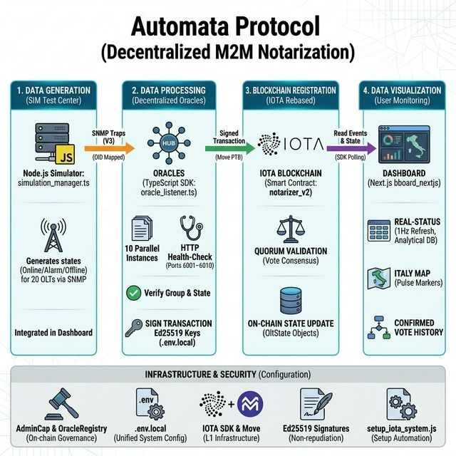

# Automata Protocol
## Decentralized Notarization Architecture for Hardware Monitoring

*MasterZ × IOTA Hackathon 2026 — Logical Documentation*

---

## The Problem

In modern telecommunications and industrial infrastructure, Service Level Agreements (SLAs) define contractual obligations around hardware availability. When a device goes offline, an alarm is triggered, or a service degrades, two parties — the provider and the customer — need to agree on what happened, when, and for how long.

Today, this verification relies entirely on **centralized, internally managed logs**. The provider records the event. The provider presents the evidence. The customer has no independent way to verify the data has not been altered, delayed, or selectively omitted.

This creates a fundamental trust gap:
- Logs can be modified after the fact
- Timestamps can be manipulated
- No neutral third party certifies the state at the moment it occurred
- Disputes are resolved through negotiation, not cryptographic proof

The result: **SLA disputes are expensive, slow, and inherently biased toward the party that controls the data.**

---

## The Solution

**Automata Protocol** replaces centralized log management with a **decentralized, machine-to-machine notarization layer** built on the IOTA blockchain.

Every state change of a monitored device is:
1. **Detected** automatically by independent observer processes (oracles)
2. **Voted on** by multiple independent oracles through a consensus mechanism
3. **Certified** on-chain only when a quorum is reached
4. **Stored immutably** on the IOTA blockchain with a cryptographic timestamp
5. **Publicly verifiable** by any party, at any time, without intermediaries

No human operator touches the process. No single entity controls the truth. The proof exists from the exact moment the event occurs — **immutable, neutral, and legally defensible.**

---

## Why IOTA

The choice of IOTA as the underlying blockchain is not incidental — it is architecturally essential.

### Object-Centric Model and Native Parallelism

IOTA Rebased introduces an **object-centric execution model** based on the Move language. Every monitored device is represented as an independent shared object on-chain. This means:

- Oracle-1 can update the state of Device-A at the exact same moment Oracle-2 updates Device-B
- No transaction queue, no gas contention, no sequential bottleneck
- The system scales **linearly** with the number of devices

On traditional account-based blockchains (e.g., Ethereum), concurrent updates to a shared state create contention and require sequential processing. In a real-world deployment monitoring thousands of devices, this becomes a critical limitation. On IOTA, it is a non-issue by design.

### Low and Predictable Fees

Industrial monitoring generates high-frequency events. A network of 1,000 devices with 10 oracles each can produce tens of thousands of transactions per hour. On high-fee networks, this is economically unsustainable at scale. IOTA's fee structure makes continuous, high-frequency notarization economically viable in production.

### Move Language Security

The smart contract is written in **Move**, a language designed specifically for asset management and resource safety. Key guarantees:
- No reentrancy attacks by design
- Strong type system prevents integer overflows and unauthorized state mutations
- Resources cannot be duplicated or accidentally destroyed

### IOTA Notarization — Trust Framework Alignment

This project implements **IOTA Notarization**, one of the core services of the IOTA Trust Framework. The on-chain state of each device represents a certified, timestamped record of reality — exactly what the Trust Framework is designed to enable.

---

## System Architecture

The system is composed of three independent layers that interact in a strict one-way flow.

```
Physical / Simulated Devices
        │
        │ SNMP V3 (AuthPriv)
        ▼
   Oracle Layer (10 independent processes)
        │
        │ Signed Transactions (IOTA SDK)
        ▼
   IOTA Blockchain (Move Smart Contract)  ← The Brain of the System
        │
        │ RPC Event Polling
        ▼
   Dashboard (Next.js — Real-time visualization)
```



**Fundamental principle**: the JavaScript code of the oracles is exclusively a messenger — it receives signals from devices and translates them into blockchain transactions. The **Move contract** is the true brain of the system: it defines the rules, manages permissions, validates votes, and decides when a state is officially certified. The oracles simply follow what the contract enforces.

---

## Layer 1 — Move Smart Contract (The Brain)

### Initialization and AdminCap

When the contract is deployed, two fundamental objects are automatically created:

**`AdminCap`** — An administration capability transferred to the wallet that performed the deploy. It is a unique, non-duplicable object: **only whoever holds the AdminCap can configure the system**. Without it, no configuration operation is possible. This ensures that system governance is controlled by a cryptographically verifiable identity, not a password or privileged server access.

**`OracleRegistry`** — The central shared registry, created with a default quorum threshold of 3 votes. It is immediately made available as a shared object on the blockchain, readable by anyone and writable only through the contract's authorized functions.

### How Devices Are Created

Monitored devices do not exist by default — they are **explicitly created on-chain** by the administrator through the `create_olt_state` function, which mandatorily requires the `AdminCap`.

For each device, the administrator specifies:
- A **unique ID** (`olt_id`) — the numeric identifier of the device
- A **group assignment** (`group_id`) — which oracle group is responsible for monitoring it

The contract creates an independent `OltState` object for that device and registers it in the Registry with two mappings via Dynamic Fields:
- `olt_id → ObjectID` (to locate the device object)
- `olt_id → group_id` (to know which group is responsible)

Every `OltState` is born with status `0` (Offline) and is immediately shared on the blockchain as a public object.

### How Oracles Are Authorized

Oracles do not have automatic permissions — they must be **explicitly authorized** by the administrator through `grant_group_permission`, which also requires the `AdminCap`.

For each oracle, the administrator specifies:
- The oracle's **wallet address**
- The **group** it is authorized to vote for

The contract adds the `group_id` to the oracle's permissions vector in the Registry. An oracle can be authorized for multiple groups, or can have its permissions revoked for a specific group through `revoke_group_permission` — without restarting any process.

### How the Quorum Threshold Is Managed

The quorum threshold — how many votes are required to certify a state — is **configurable by the administrator** through `set_threshold`. It is not a hardcoded value: it can be modified at any time to adapt to different scenarios (more oracles, stricter security requirements, testing).

In the current demo configuration: **threshold = 3** out of 5 oracles per group, i.e., a simple majority.

### How a Device Is Moved Between Groups

The administrator can reassign a device to a different group through `move_olt_to_group`. The contract updates both the device's `OltState` and the mapping in the Registry — guaranteeing atomic consistency between the two structures.

### Notarization Logic (The Core Function)

The `notarize_parallel` function is called by oracles for each vote. The contract executes in sequence:

1. **Authorization**: verifies the calling wallet has permissions for the device's group
2. **Anti-redundancy**: if the current state already matches the voted one, the transaction is rejected to avoid wasting gas
3. **Vote collection**: adds the oracle's vote to the device's temporary `VoteTable` (Dynamic Field on `OltState`)
4. **Anti-double-vote**: each oracle can vote only once per state (idempotent)
5. **Quorum check**: if the number of votes reaches the threshold → the state is updated, the `VoteTable` deleted to free storage
6. **Event emission**: in every case (vote registered or quorum reached) a `StatusEvent` is emitted with all details, including the `confirmed` field indicating whether quorum was reached

**Key point**: the `VoteTable` is a Dynamic Field on the `OltState` object. This means on-chain storage is consumed only while votes are pending and is automatically reclaimed after confirmation — maximum efficiency.

---

## Layer 2 — Oracle Network (Node.js / TypeScript)

Ten independent oracle processes run in parallel, divided into two groups according to the configuration established by the Move contract:

| Group | Oracles | Devices Monitored |
|-------|---------|-------------------|
| A     | 1 – 5   | OLT 1 – 10        |
| B     | 6 – 10  | OLT 11 – 20       |

Each oracle process:
- **Listens** for SNMP V3 traps on a dedicated UDP port (5005–5014)
- **Validates** that the device belongs to its assigned group
- **Detects** state changes by comparing incoming status with its local registry
- **Queues** a vote transaction when a change is detected
- **Signs and submits** the transaction using its unique Ed25519 keypair via the IOTA TypeScript SDK
- **Retries** failed transactions up to 3 times with exponential backoff
- **Detects timeouts**: if no signal is received from a device within 70 seconds, the oracle automatically votes for Offline status — no human intervention required

Each oracle also exposes a lightweight **HTTP health endpoint** for real-time process monitoring by the dashboard.

**Key design property**: oracle processes are fully independent. The crash of one does not affect the others. The system continues to function as long as quorum can be reached by the remaining active oracles — thanks to the threshold configured in the Move contract.

**It is the Move contract that decides**: even if an oracle attempts to vote outside its permissions, the contract rejects the transaction. Security does not depend on the correctness of the JavaScript code — it depends on the immutable rules written on-chain.

---

## Layer 3 — Dashboard (Next.js)

The dashboard serves as the **observation and verification interface**. It does not write to the blockchain — it only reads.

- Polls the IOTA node via RPC every second for new events and object states
- Displays the certified status of all devices in real-time
- Shows the full audit log of confirmed notarizations with direct links to the IOTA Explorer
- Monitors oracle process health (uptime, vote counts, last activity)
- Includes a simulation controller for demo purposes

---

## The OLT Use Case

Optical Line Terminals (OLTs) are critical network devices in fiber-optic telecommunications infrastructure. They aggregate traffic from hundreds of end-user ONUs (Optical Network Units) and are directly responsible for service availability.

An OLT going offline means service disruption for potentially thousands of users. In an SLA context, every minute of downtime has a contractual cost.

In this implementation:
- 20 OLTs are created on-chain by the administrator and distributed across two geographic groups
- 10 oracle processes, explicitly authorized in the contract, observe and notarize every state transition
- The quorum threshold (3 out of 5) ensures no single oracle can unilaterally certify a false state
- Every confirmed state change is permanently recorded on IOTA with a cryptographic proof

The result is an **independent, tamper-proof audit trail** of OLT availability — directly usable as evidence in SLA dispute resolution without relying on any party's internal systems.

---

## Security Model

### SNMP V3 AuthPriv

Communication between monitored devices and oracle processes uses **SNMP Version 3** with the highest security level (`authPriv`):
- **Authentication**: HMAC-SHA-96 — ensures the trap originates from a legitimate source
- **Encryption**: AES-128 (CFB mode) — protects the payload in transit

This is the same protocol used by enterprise network management systems (Cisco, Nokia, Huawei). No modification to existing infrastructure is required — oracles integrate transparently with production hardware.

### Oracle Identity and Non-Repudiation

Each oracle uses a unique **Ed25519 keypair** to sign every transaction. Every vote is cryptographically attributed to a specific wallet address. No oracle can deny having submitted a vote, and no external entity can forge a vote on behalf of an oracle.

### Security Guaranteed by the Contract, Not by JS Code

The security of the system does not depend on the correctness or integrity of the oracles' JavaScript code. Even a compromised or malicious oracle cannot:
- Vote for a group it is not authorized for (the contract rejects the transaction)
- Vote twice for the same state (the contract rejects with `EAlreadyVoted`)
- Confirm a state alone without reaching quorum

All rules are written in the Move contract and are immutable once deployed.

---

## Generalizability — Beyond OLTs

The smart contract has no knowledge of what an OLT is. It operates on three primitives: a **device ID**, a **numeric status**, and a **timestamp**.

Any device that can be observed through a standard industrial protocol can be integrated into this architecture. The administrator creates new device objects on-chain through `create_olt_state`, authorizes new oracles through `grant_group_permission`, and adapts only the oracle listener layer to the specific protocol. The blockchain contract remains unchanged.

| Sector | Device | Protocol | Use Case |
|--------|--------|----------|----------|
| Telecommunications | OLT, Router, Switch | SNMP V3 | SLA uptime certification |
| Energy | Solar inverter, Wind turbine | Modbus, MQTT | Incentive eligibility proof |
| Logistics | Refrigerated container | MQTT, HTTP | Cold chain integrity certification |
| Industry 4.0 | CNC machine, Robot arm | OPC-UA, Modbus | Leasing SLA compliance |
| Smart Building | HVAC, Fire suppression | BACnet, SNMP | Insurance and compliance auditing |
| Healthcare | Medical device, UPS | SNMP, HL7 | Certified uptime for regulated equipment |

---

## Machine-to-Machine: Removing Human Responsibility

One of the most significant properties of this architecture is the complete elimination of human operators from the certification process.

In traditional monitoring:
- A human reads the log
- A human decides when to escalate
- A human timestamps the incident report
- A human presents the evidence

Every step introduces the possibility of error, bias, or manipulation.

In Automata Protocol:
- The device generates the signal
- The oracle detects and validates it automatically
- The Move contract certifies it cryptographically according to immutable rules
- The proof is available instantly, without any human action

This is true **machine-to-machine trust** — the state of a physical device is certified by a decentralized consensus of software agents, with rules defined on-chain, with no human in the loop and no possibility of post-hoc alteration.

---

## Summary

| Property | Value |
|----------|-------|
| Blockchain | IOTA Rebased (Testnet) |
| Smart Contract Language | Move |
| Oracle Technology | Node.js / TypeScript + IOTA SDK |
| Device Communication | SNMP V3 AuthPriv |
| Monitored Devices | 20 OLTs (simulated) |
| Oracle Processes | 10 independent workers |
| Consensus Threshold | Configurable via AdminCap (default: 3) |
| Device Creation | On-chain via AdminCap |
| Oracle Authorization | On-chain via AdminCap |
| Dashboard | Next.js — real-time blockchain polling |
| Transaction Verification | Public IOTA Explorer links |
| Human Intervention Required | None |

---

*Automata Protocol — MasterZ × IOTA Hackathon 2026*
*Last Updated: March 2026*
