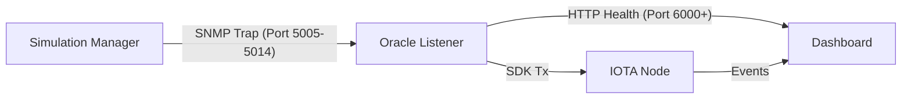

# 📡 Automata Protocol — Technical Documentation (V2)

## Architecture: SDK-Native Parallel Notarization

This document provides a comprehensive technical overview of the OLT (Optical Line Terminal) monitoring and notarization system, built on the **IOTA Rebased** framework using the **official TypeScript SDK**. It includes detailed analysis of the backend simulation and oracle logic.

---

## 1. System Philosophy

The architecture moves away from legacy sequential processing to a **granular parallelized model**. Every OLT is treated as an independent state machine on the blockchain, allowing simultaneous updates from different Oracles without gas contention or transaction sequencing bottlenecks.

### Core Objectives:
*   **Decentralized Trust**: Multi-oracle consensus before any state change is confirmed.
*   **Scalability**: Optimized for high-frequency updates across hundreds of devices.
*   **Security**: SNMP V3 AuthPriv standards for local network communication.
*   **Observability**: Real-time visualization of blockchain events and process health.

---

## 2. Technical Stack

| Layer | Technology | Role |
| :--- | :--- | :--- |
| **Blockchain** | IOTA Rebased (Move) | Immutable storage of OLT states & Quorum logic |
| **SDK** | `@iota/iota-sdk` | Native transaction building and signing |
| **Oracles** | Node.js / TypeScript | SNMP Listener + Blockchain Worker |
| **Frontend** | Next.js 15 (App Router) | Live Analytics Dashboard & System Controller |
| **Messaging** | SNMP V3 (Net-SNMP) | Industrial protocol for device status traps |
| **Simulation** | Node.js Child Processes | Local emulation of 10 Oracles and 20 OLTs |

---

## 3. High-Level Architecture

### A. The Move Smart Contract (`notarization_v2`)
The contract is designed with an **Object-Centric** approach that guarantees maximum parallelization and efficiency.

**OLT Management (Independent Objects)**
The architecture uses a separate shared object for each OLT (`OltState`). This eliminates any object contention between different OLTs, allowing parallel transactions without blocking each other.

```move
public struct OltState has key {
    id: UID,
    olt_id: u64,
    group_id: u8,       // Group membership (A or B)
    status: u8,         // Current status (0=Offline, 1=Operational, 2=Alarm)
    last_update: u64,   // Last update timestamp
    last_validator: address // Address of the last oracle that voted
}
```

**Oracle Management and Permissions**
Oracles are not hardcoded, but managed dynamically via the `Registry` using Dynamic Fields.
-   **Authorization**: Each oracle has a permission vector (`vector<u8>`) indicating which OLT groups it can notarize.
-   **Surgical Failover**: If an oracle fails, it can be revoked or added dynamically without restarting the system.

```move
public struct OracleRegistry has key {
    id: UID,
    threshold: u64, // Required quorum (e.g., 3)
}

// Mapping: Oracle Address -> List of authorized groups
public struct OraclePermKey has copy, drop, store { oracle: address }
```

**Quorum Logic and Notarization**
The `notarize_parallel` function is the core of execution:
1.  **Authorization**: Verifies that the sender has permission for the OLT's group.
2.  **Single Vote**: Each oracle can vote once per specific status (verifies `EAlreadyVoted`).
3.  **Dynamic Vote Table**: Votes are stored as Dynamic Fields on the `OltState` object, key = `new_status`.
4.  **Quorum**: When the number of votes reaches `registry.threshold`, the OLT status is updated and the vote table is removed for cleanup.

```move
// 4. QUORUM CHECK
let vote_table = df::borrow<u8, VoteTable>(&olt_state.id, new_status);
let num_votes = vector::length(&vote_table.voters);
let confirmed = num_votes >= registry.threshold;

if (confirmed) {
    olt_state.status = new_status; // Update global status
    // Remove vote table to free space
    let VoteTable { voters: _, target_status: _ } =
        df::remove<u8, VoteTable>(&mut olt_state.id, new_status);
};
```

**Parallelization**
Thanks to the independence of `OltState` objects, 10 Oracles can send transactions simultaneously to 10 different OLTs without transactions blocking in a queue. Gas is limited to the single OLT, not the entire system.

**Registry and Dynamic Fields**
The central `Registry` maps:
-   `OltDiscoveryKey`: OLT object ID
-   `OltGroupKey`: Group membership
-   `OraclePermKey`: Oracle permissions

### B. The Oracle Worker (`oracle_listener.ts`)
Each of the 10 Oracles runs as an independent Node.js process:
1.  **SNMP Receiver**: Listens for V3 Traps on ports 5005-5014. It uses `AuthPriv` (SHA/AES) for secure communication.
2.  **Filter Logic**: Only processes traps for OLTs assigned to its specific group (Group A: Oracles 1-5 for OLTs 1-10; Group B: Oracles 6-10 for OLTs 11-20).
3.  **State Management**:
    *   Maintains an in-memory `oltRegistry` map.
    *   Tracks `currentStatus` and `lastSeen` timestamps.
    *   Simulates "offline" state detection via `checkTimeouts` (if no trap received within `TIMEOUT_LIMIT`, status resets to 0).
4.  **SDK Bridge**:
    *   Creates a `Transaction` block using `@iota/iota-sdk`.
    *   Firms it using an `Ed25519Keypair` loaded into memory from environment variables.
    *   Executes the call via `signAndExecuteTransaction`.
5.  **Health Server**: A background HTTP server (`6000 + id`) used by the dashboard to monitor process uptime and vote counts.

### C. The Dashboard & Coordinator
The Next.js application serves two purposes:
1.  **UI**: Visualizes data retrieved via the SDK (polling the blockchain every second).
2.  **Simulation Manager**: Uses Node.js `spawn` to manage local Oracle processes and simulates SNMP traffic for testing.

---

## 5. Backend Simulation Details

The simulation backend allows testing the entire blockchain interaction flow locally without physical hardware.

### A. Simulation Manager (`simulation_manager.ts`)
Located in `dashboard_nextjs/lib/simulation_manager.ts`.

**Initialization:**
-   Spawns 10 Oracle processes (`oracle_listener.ts`) via `child_process.spawn`.
-   Initializes 20 OLT objects in memory with default status `1` (Operational).

**SNMP Trap Generation:**
The manager acts as a synthetic SNMP master agent:
1.  **Session Creation**: Creates V3 sessions for each Oracle port (5005-5014) using credentials defined in `SNMP_USER`.
2.  **Heartbeat Loop**: Runs a `setInterval` (60 seconds) to broadcast status updates for all active OLTs.
3.  **Trap Payload**:
    *   `OID_OLT_ID`: The OLT identifier (1-20).
    *   `OID_STATUS`: The current status (0=Offline, 1=Operational, 2=Alarm).
    *   `OID_TIMESTAMP`: Unix timestamp.

**Oracle Process Spawning:**
-   **Command**: `node oracle_listener.js <oracleId> <port> <privateKeyBase64>`
-   **Environment**: Inherits parent environment variables (including `RPC_URL`, `PACKAGE_ID`).
-   **Lifecycle**: Managed via `ChildProcess` object. If a process crashes, it is marked inactive.

### B. Oracle Listener Logic (`oracle_listener.ts`)
Located in `dashboard_nextjs/oracle_listener.ts`.

**1. Trap Handling (`handleSnmpTrap`):**
-   Receives raw SNMP V3 traps.
-   Extracts `OID_OLT_ID` and `OID_STATUS`.
-   **Group Validation**: Ensures the OLT belongs to the Oracle's assigned group.
-   **State Update**:
    -   **New OLT**: If OLT doesn't exist in registry, adds it and adds to `voteQueue`.
    -   **Existing OLT**: If status differs from registered status, adds to `voteQueue`.
    -   Always updates `lastSeen` timestamp.

**2. Voting Queue (`voteQueue`):**
-   A FIFO queue processing status changes.
-   **Retry Mechanism**: If a blockchain transaction fails (e.g., transient network error), it retries up to 3 times with exponential backoff (5s ± random 5s).
-   **Timestamp Handling**: Uses `Math.floor(Date.now() / 1000)` for standard Unix timestamps.

**3. Blockchain Interaction (`executeVote`):**
-   **Target**: `${PACKAGE_ID}::notarizer_v2::notarize_parallel`
-   **Arguments**:
    1.  `REGISTRY_ID`: Shared registry object.
    2.  `oltObjId`: Specific OLT object ID (from `OLT_OBJECT_IDS` env var).
    3.  `status`: `u8` (0, 1, or 2).
    4.  `timestamp`: `u64`.
    5.  `oracleId`: `u64`.
-   **Gas Handling**: SDK automatically estimates and allocates gas. Spent gas is logged.

**4. Timeout Simulation (`checkTimeouts`):**
-   Runs every 10 seconds.
-   Checks `lastSeen` timestamp for every OLT in the registry.
-   If `now - lastSeen > TIMEOUT_LIMIT * 1000` (default 70s) and status is not 0:
    -   Sets status to 0 (Offline).
    -   Adds a vote to the queue to propagate this offline state to the blockchain.
-   *Note*: This simulates an OLT physically losing connectivity or power.

### C. Data Flow Diagram (Simulation)



---

## 6. Security Implementation: SNMP V3

Communication between OLTs (simulated) and Oracles follows the **User-based Security Model (USM)**:
*   **Security Level**: `authPriv` (Authentication + Privacy).
*   **Authentication**: HMAC-SHA-96.
*   **Encryption**: AES-128 (CFB mode).
*   **Credentials**:
    *   User: `olt_user`
    *   Auth Key: `auth12345`
    *   Priv Key: `priv12345`
*   **Group Isolation**: Group A (Oracles 1-5) manages OLTs 1-10; Group B (Oracles 6-10) manages OLTs 11-20.

---

## 7. Deployment & Configuration

### Automated Environment Setup
The project includes a `setup_iota_system.js` utility script to automate the initial configuration.

**Workflow:**
1.  **Wallet Generation**: Automatically creates 10 Oracle wallets if they don't exist in the IOTA CLI.
2.  **Faucet Funding**: Detects low balances (<10 IOTA) and requests funds from the Testnet Faucet automatically.
3.  **Oracle Funding**: Distributes 0.9 IOTA to each Oracle wallet for gas fees.
4.  **Contract Deployment**: Publishes the Move package and initializes the global Registry.
5.  **Environment Sync**: Generates the `.env.local` file with all correct IDs and private keys.

```bash
node setup_iota_system.js
```

### Manual Environment Variables (`.env.local`)
If configuring manually, the system expects these variables in `dashboard_nextjs/.env.local`:

---

## 8. Data & Performance Optimization

*   **Blockchain Reliability**: Uses native blockchain metadata (`timestampMs`) for event history.
*   **Time Synchronization**: Automatic detection of date formats (seconds vs milliseconds).
*   **Observability**: Dashboard analyzes up to **1000 recent events** (10 pages).
*   **Signing Latency**: <50ms (in-memory SDK).
*   **Dashboard Refresh**: 1Hz (per-second polling).

---

## 9. User Interface (KPI Dashboard)

The "Oracle Network" dashboard uses specific color coding:
*   **🟢 Total Votes Cast**: Indicates all work performed by oracles in real-time (votes sent).
*   **🔵 Confirmed On-Chain**: Indicates only notarizations that have officially reached quorum on the blockchain.
*   **🟢 Confirmation Rate**: Success percentage of votes versus definitive confirmations.

---

*Last Updated: March 2026*
